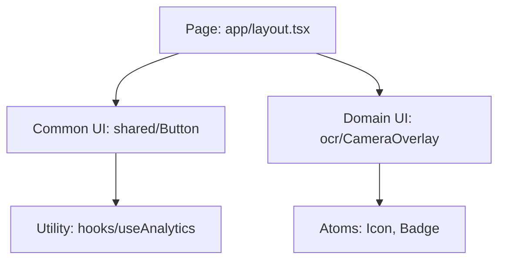

# 🎨 Frontend Style Guide
> 프로젝트의 일관된 UI/UX 구현 및 유지보수 효율성을 위한 기술 표준입니다.

---

## 📑 바로가기 (Table of Contents)
1.  [**Design Tokens**](#1-design-tokens) - 컬러 및 타이포그래피 표준
2.  [**Architecture**](#2-architecture) - 컴포넌트 및 프로젝트 구조
3.  [**Interaction**](#3-interaction) - 상태 처리 및 사용자 피드백
4.  [**Checklist**](#4-development-checklist) - 개발 전 필수 확인 사항

---

## 💎 1. Design Tokens

### A. Color Palette (Earth & Warmth)
사용자께서 최종 선택하신 이 팔레트는 **'따뜻한 신뢰'**와 **'자연스러운 안정감'**을 주는 디자인입니다. 베이지와 브라운 톤은 신체 건강을 다루는 서비스에서 사용자에게 편안함과 정서적 지지(Support)를 느끼게 합니다.

| Category | Token Name | Hex Code | Preview | Usage | Role |
| :--- | :--- | :--- | :--- | :--- | :--- |
| **Brand** | `--color-primary` | `#BFA78A` | � | **Point Color:** 핵심 액션 버튼, 강조 텍스트 | Primary |
| **Brand** | `--info-color` | `#D9BB96` | 🏼 | **Sub Color:** 칩(Chip), 카테고리 구분, 보조 버튼 | Secondary |
| **Surface** | `--color-surface` | `#F2EBDC` | 🥚 | **Surface:** 카드 요소 배경, 입력창 영역 | Surface |
| **Base** | `--color-bg` | `#F2F2F2` | ⚪ | **Background:** 앱 전체의 기본 배경색 (미색) | Base |
| **Contrast** | `--color-text` | `#403E3C` | ⚫ | **Text:** 본문 및 제목 텍스트 (깊은 차콜 브라운) | Contrast |

> [!IMPORTANT]
> **대비(Contrast) 주의:** 팔레트 특성상 전반적으로 명도가 높습니다. 텍스트는 반드시 `--color-text`(`#403E3C`)를 사용하여 가독성을 확보해 주세요. 밝은 베이지 배경 위에서도 충분한 대비가 필요합니다.

---

### B. Typography
모바일 가독성을 위해 **Pretendard** 서체를 기본으로 합니다.

> [!TIP]
> **Line-height 규칙:** 본문(Body)은 가독성을 위해 `1.6` 이상, 제목(Heading)은 `1.2`~`1.4`를 유지합니다.

---

## 🏗️ 2. Architecture

### A. Component Hierarchy
컴포넌트는 역할에 따라 엄격히 분리하여 재사용성을 높입니다.

### B. Directory Structure
- `components/shared`: 전역 공통 컴포넌트 (Inputs, Buttons, Modals)
- `components/features`: 특정 기능 종속 컴포넌트 (OCR, ProfileCard)
- `hooks`: 전역적으로 공유되는 커스텀 훅

---

## ⚡ 3. Interaction & UX

### A. 비동기 상태 UI 대응 (Essential)
모든 데이터 요청 작업 시 다음 3단계 대응이 필수입니다.

1.  **Skeleton UI**: 데이터 로딩 시 레이아웃 흔들림 방지.
2.  **Aria-Live**: 스크린 리더 사용자를 위한 상태 변경 알림 (`role="status"`).
3.  **Graceful Error**: 에러 발생 시 사용자 이탈 방지를 위한 '재시도' 버튼 제공.

### B. 레이아웃 시스템
- **Spacing Scale:** `px = n * 4` (예: p-4 = 16px)
- **Safe Area:** 모바일 노치(Notch) 영역 대응을 위해 `env(safe-area-inset-top)` 등을 연동.

---

## ✅ 4. Development Checklist
작업을 시작하기 전 다음 사항을 확인했나요?

- [ ] `tailwind.config.ts`에 최신 컬러 토큰이 등록되어 있는가?
- [ ] 폰트 사이즈가 정의된 스케일(1rem, 1.5rem 등) 내에 있는가?
- [ ] 이미지 최적화(`next/image`)를 적용했는가?
- [ ] 다크 모드(Dark Mode) 지원 시 색상 반전 처리가 되어 있는가?

---

